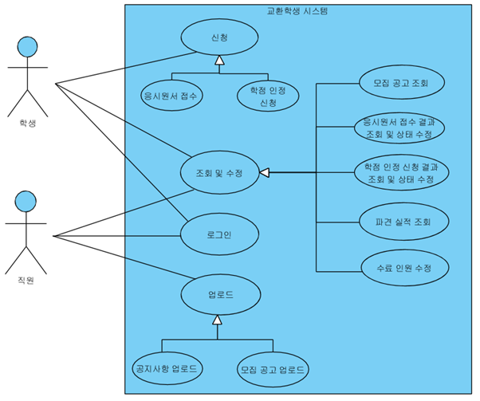
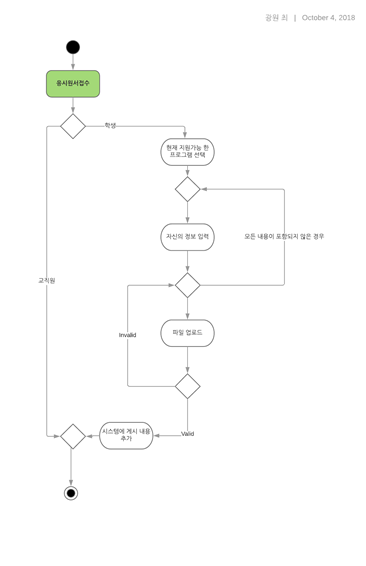
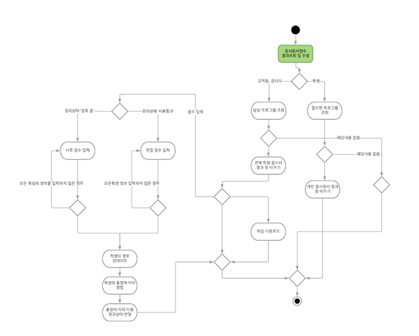

# SoftwareDesign
## 1. 프로그램 소개
### 1.1 해외대학 교환학생 지원 시스템

경북대학교에서는 재학기간동안 한 학기 또는 두 학기 동안 해외 대학에서 공부하고 학
점을 인정받는 제도를 시행하고 있다. 현재는 교환학생 모집 공고를 인터넷에서 찾아보
고 지원서류를 국제교류처에 제출하여 응시하게 되어 있으며, 선발, 결과 통보, 학점 인
정 등 모든 과정을 국제교류처 담당 직원이 직접 처리하고 있다. 현재의 시스템을 개선
해서 최대한 모든 프로세스를 자동화 하는 새로운 시스템을 개발하고자 한다. 특히, 사
용자는 다음과 같은 기능들을 담당직원의 도움 없이 수행할 수 있어야 한다
- 교환학생 모집 공고의 조회
- 응시원서의 접수 및 결과 조회
- 학점 인정 신청 및 결과 조회
- 기간별 교환학생 파견 실적 조회 

### 1.2 제작기간

#### ~ 10.4 Requirements & Usecase Diagram.
#### ~ 11.1 Class Diagram & Sequence Diagram
#### ~ 11.22 Design Documents
#### ~ 12.7 System Programming.

## 2. Documents
### 2.1 UserRequirements
<https://github.com/KwangwonChoi/SoftwareDesign/blob/master/Requirement&UseCase/08%ED%8C%80%20%EC%9A%94%EA%B5%AC%EC%82%AC%ED%95%AD%20%EB%AC%B8%EC%84%9C.docx?raw=true/>
### 2.2 UseCase Diagram

### 2.3 Activity Diagram
#### 
#### 
#### 

